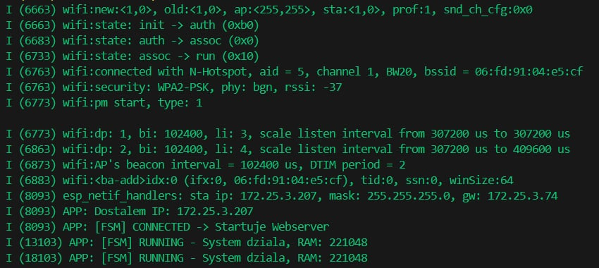

# Projekt Zaliczeniowy: Mini-Webserver Statusu ESP32
<p align="center">
  
</p>

## 1. Opis Projektu
Projekt realizuje zdalny panel sterowania i monitoringu oparty na układzie ESP32. Urządzenie działa jako serwer HTTP, udostępniając responsywny interfejs WWW (Web UI) do sterowania diodą LED oraz odczytu symulowanych danych telemetrycznych (temperatura). System zaprojektowano zgodnie z paradygmatem maszyny stanów (FSM) z obsługą błędów połączenia.

**Funkcjonalności:**
- Podgląd temperatury w czasie rzeczywistym (AJAX/Fetch API).
- Zdalne sterowanie oświetleniem (LED) poprzez REST API.
- Nowoczesny interfejs graficzny (Dark Mode, Card UI).
- Automatyczne wznawianie połączenia Wi-Fi (Reconnection Policy).

## 2. Wymagania Sprzętowe i Programowe
- **Hardware:** Płytka rozwojowa ESP32 (np. ESP32-DevKitV1).
- **Software:** VS Code + rozszerzenie Espressif IDF (v5.x).
- **Zasilanie:** USB 5V (komputer lub ładowarka).

## 3. Konfiguracja i Uruchomienie

### Krok 1: Konfiguracja Wi-Fi
Przed kompilacją należy podać dane do lokalnej sieci Wi-Fi w pliku `main/main.c`:
```c
#define EXAMPLE_ESP_WIFI_SSID      "TWOJA_NAZWA_SIECI"
#define EXAMPLE_ESP_WIFI_PASS      "TWOJE_HASLO"
```
### Krok 2: Budowanie i Flashowanie
- Otwórz projekt w VS Code.
- Podłącz płytkę ESP32 do portu USB.
- Wybierz odpowiedni port COM i cel esp32 (na dolnym pasku).
- Kliknij ikonę Build, Flash and Monitor (symbol płomienia).

### Krok 3: Obsługa
 - Po uruchomieniu obserwuj terminal (Monitor).
 - Gdy urządzenie połączy się z siecią, wyświetli adres IP:


 - Wpisz ten adres IP w przeglądarce na komputerze lub telefonie (urządzenie musi być w tej samej sieci Wi-Fi).

## 4. Struktura Projektu
- **main/main.c** - Główny kod aplikacji, implementacja FSM, logika serwera HTTP.
- **design.md** - Dokumentacja techniczna, opis architektury i protokołu.
- **CMakeLISTS.txt** - Konfiguracja systemu budowania.