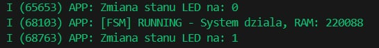

# Dokumentacja Techniczna (Design Doc)

## 1. Architektura Systemu
System został zrealizowany w architekturze warstwowej, oddzielającej logikę sterowania od warstwy sprzętowej (HAL).

1.  **Warstwa Wejścia (Input):**
    -   **Sensor wirtualny:** Symulator temperatury generujący dane pseudolosowe z offsetem, emulujący odczyty z termostatu pokojowego w zakresie 20-30°C.
2.  **Warstwa Wyjścia (Output):**
    -   **Aktuator:** Dioda LED (GPIO 2) sterowana sygnałem cyfrowym.
    -   **Interfejs:** Serwer HTTP serwujący statyczny HTML/CSS/JS oraz endpointy JSON API.
3.  **Warstwa Logiki:**
    -   Centralna maszyna stanów (FSM) zarządzająca cyklem życia aplikacji.
    -   Event Group (FreeRTOS) do asynchronicznej synchronizacji zdarzeń sieciowych.

## 2. Maszyna Stanów (FSM)
Program sterowany jest przez deterministyczną maszynę stanów (`system_state_t`), co zapewnia przewidywalne zachowanie i obsługę błędów (Safety).

**Diagram przejść:**
`INIT` -> `CONNECTING` <-> `RUNNING` -> `ERROR`

1.  **STATE_INIT:**
    -   Inicjalizacja pamięci NVS (Non-Volatile Storage).
    -   Konfiguracja GPIO w trybie Output.
    -   Inicjalizacja stosu TCP/IP.
2.  **STATE_CONNECTING:**
    -   Aktywne próby nawiązania połączenia z Access Pointem.
    -   Sygnalizacja wizualna: Miganie diodą LED.
    -   *Warunek przejścia:* Otrzymanie zdarzenia `IP_EVENT_STA_GOT_IP`.
3.  **STATE_RUNNING:**
    -   Uruchomienie serwera HTTP na porcie 80.
    -   Obsługa żądań REST API w tle.
    -   Ciągłe monitorowanie stanu połączenia.
    -   *Warunek błędu:* Utrata połączenia Wi-Fi -> powrót do `CONNECTING`.
4.  **STATE_ERROR:**
    -   Stan bezpieczny (Fail-Safe).
    -   Zatrzymanie usług sieciowych.
    -   Restart systemu (`esp_restart`) jako procedura naprawcza.

## 3. Protokół Komunikacyjny (REST API)
Aplikacja udostępnia interfejs REST (oparty na metodzie GET) do komunikacji z klientem (przeglądarką).

| Metoda | Endpoint | Parametry | Opis | Format odpowiedzi |
| :--- | :--- | :--- | :--- | :--- |
| `GET` | `/` | brak | Zwraca interfejs użytkownika (SPA - Single Page App). | `text/html` |
| `GET` | `/status` | brak | Pobiera telemetrię (stan LED, temp, uptime). | `application/json` |
| `GET` | `/set` | `led=0` lub `led=1` | Steruje wyjściem (włącz/wyłącz diodę). | `text/plain` |




**Przykładowy JSON statusu (`/status`):**
```json
{
  "led": true,
  "temp": 24,
  "uptime": 120
}